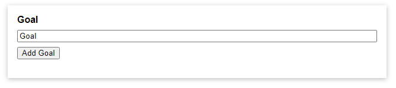
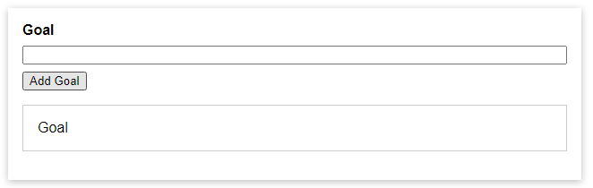

# Trang web thêm lời nhắc cơ bản

HTML code:

```html
<!DOCTYPE html>
<html lang="en">
	<head>
		<meta charset="UTF-8" />
		<meta name="viewport" content="width=device-width, initial-scale=1.0" />
		<title>A First App</title>
		<link rel="stylesheet" href="styles.css" />
	</head>
	<body>
		<div id="app">
			<div>
				<label for="goal">Goal</label>
				<input type="text" id="goal" v-model="enteredValue" />
				<button v-on:click="addGoals">Add Goal</button>
			</div>
			<ul>
				<li v-for="goal in goals">{{goal}}</li>
			</ul>
		</div>
		<script src="https://unpkg.com/vue@next"></script>
		<script src="app.js"></script>
	</body>
</html>
```

Js code:

```js
Vue.createApp({
	data() {
		return {
			goals: [],
			enteredValue: "",
		};
	},
	methods: {
		addGoals() {
			this.goals.push(this.enteredValue);
			this.enteredValue = "";
		},
	},
}).mount("#app");
```

### Cách sử dụng Vue

Để sử dụng Vue, cần thêm `<script src="https://unpkg.com/vue@next"></script>` (Version 3 - Bản Development), sau đó gọi `Vue.createApp({}).mount(selector)`, với selector là CSS selector của phần tử (Tương tự như `ReactDOM.render()`).

Trong đối số đầu tiên (1 Object) của `Vue.createApp`, data là một method trả về 1 object, các property trong object trả về của data sẽ được Vue giám sát, khi giá trị của chúng bị thay đổi, Vue sẽ thay đổi DOM dựa theo sự thay đổi đó. Các method trong property methods thường được sử dụng để thay đổi các property trong object trả về của data.
Lưu ý: Các method trong methods không được định nghĩa bằng arrow function.

### Một số khái niệm cơ bản

1. Directive: Bên trong thẻ DOM mà Vue quản lý, các attribute bắt đầu bằng `v-` được gọi là directive, chúng là các attribute đặc biệt của Vue, Vue sẽ căn cứ vào chúng để thay đổi nội dung thẻ tương ứng. <br/>
   Một số directive:
    - v-model: kết nối value của thẻ input với property tương ứng trong object trả về của data. Khi một trong 2 thay đổi, cái còn lại cũng sẽ thay đổi theo.
    - v-on:click: lắng nghe sự kiện click của element
    - v-for: duyệt các phần tử bên trong mảng, object hay một khoảng
2. Interpolation({{}}): Vue sẽ thay thế {{}} bằng kết quả của biểu thức bên trong nó (trong trường hợp này thì lấy giá trị của phần tử đang được xét hiện tại trong mảng goals)

## Kết quả



<p class="center"> Trước khi click vào Add Goal </p>



<p class="center"> Sau khi click Add Goal </p>
